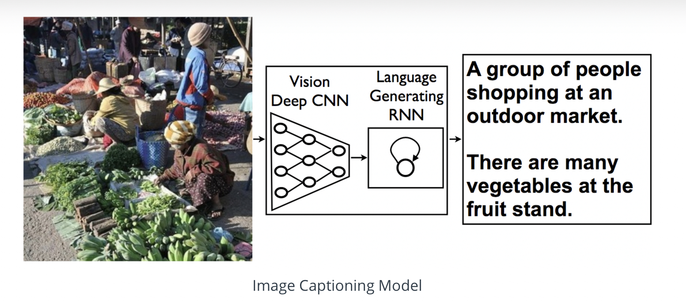
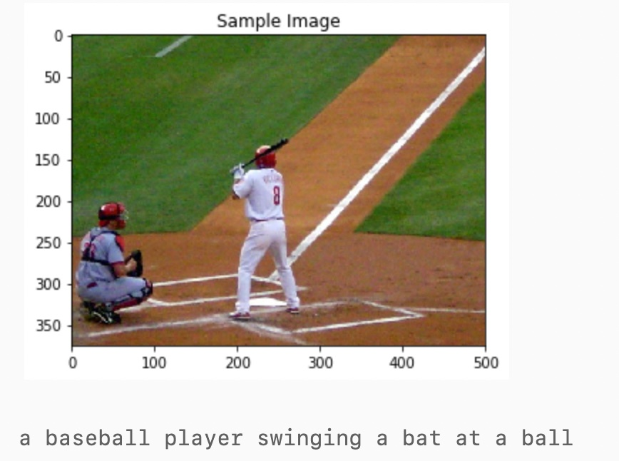
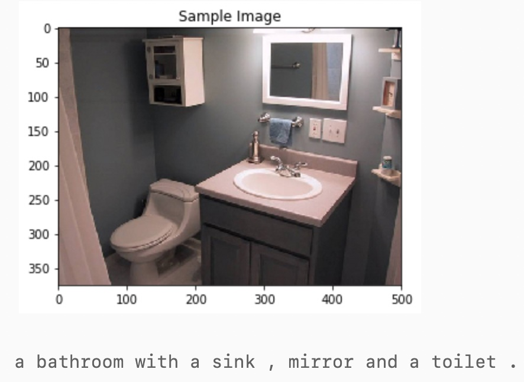
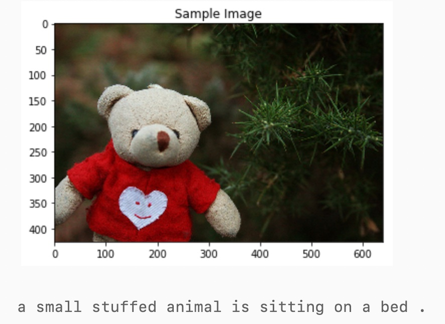

<!-- PROJECT LOGO -->
 

  <h3 align="center"><b>Image Captioning Project</b></h3>

  

    CNN-RNN model for  automatically generating image captions.
    
  

  

<!-- ABOUT THE PROJECT -->
## About The Project

This project consist the source code for designing and training a CNN-RNN (Convolutional Neural Network - Recurrent Neural Network) model for  automatically generating image captions. The network is trained on the Microsoft Common Objects in COntext [(MS COCO)](http://cocodataset.org/#home) dataset. 

## Architecture

### CNN Encoder
The encoder uses the pre-trained ResNet-101 architecture (with the final fully-connected layer removed) to extract features from a batch of pre-processed images.  The output is then flattened to a vector, before being passed through a `Linear` layer to transform the feature vector to have the same size as the word embedding.

### RNN Decoder
The CNN encoder is followed by a recurrent neural network (LSTM) that generates a corresponding sentence.The embedded image feature vector is fed into the "DecoderRNN" (which is "unfolded" in time) along with the embedded word vector. 

    

<!-- GETTING STARTED -->
## Results

    
    
    

